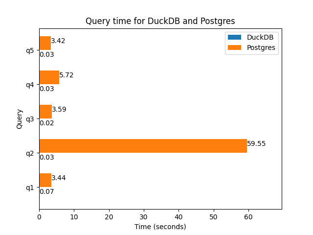
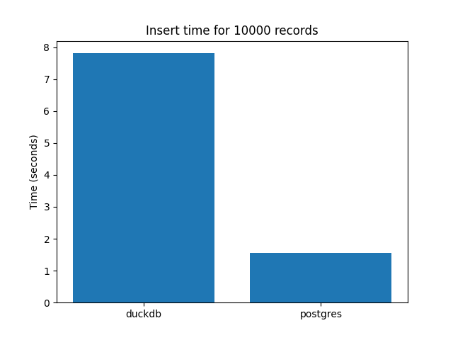

# Benchmarking OLTP vs OLAP

## Setup
1. git clone the repo
2. Install [Docker](https://www.docker.com/get-started/)
3. Check if docker compose comes installed with Docker by running `docker compose version`
4. Install [docker compose](https://docs.docker.com/compose/install/)
5. Run the docker componse

```
git clone https://github.com/jkwd/oltp_vs_olap.git
cd oltp_vs_olap
docker compose up
```

## Data Source
We are using the [TPC-H](https://www.tpc.org/tpch/) data which is a decision support benchmark. It consists of a suite of business-oriented ad hoc queries and concurrent data modifications.

## Experiment
We are going to benchmark the performance of an Online Transaction Processing (OLTP) database vs an Online analytical processing (OLAP) database on business-oriented query performance as well as transactional performance:
1. business-oriented ad hoc query by [TPC-H](https://docs.starrocks.io/docs/benchmarking/TPC-H_Benchmarking/#5-query-sql-and-create-table-statements)
2. INSERT N records

The OLTP database we are using for the experiment is a Postgres database. The OLAP database we are using is DuckDB.

## Hypothesis
The hypothesis is that the OLTP database will perform better for transactional operations such as INSERT/UPDATE/DELETE while the OLAP database will perform better for the business-oriented ad hoc query.

### Row oriented storage
In a row-oriented storage, each row in a table is stored sequentially on the disk.

| id | Name | Country |
| -- | ---- | ------- |
| 1 | Alice | USA |
| 2 | Bob | Germany |
| 3 | Charlie | Australia |
| 4 | David | Japan |

Given the example table above, a row oriented storage will be stored as:

`1 Alice USA | 2 Bob Germany | 3 Charlie   Australia | 4 David Japan`

Each `|` represents the separation of a block and each row in the table is stored within the block.

This makes the row oriented storage good for transactional use cases, which mainly focuses on INSERT/READ/UPDATE/DELETE of a single record, where if you need to update Bob's Country from Germany to Italy, you can look for the specific block about Bob and update the value. This can be achieved by creating an index of the address of each block which then allows us to directly access the block that is needed.

However, analytics queries will be poor as the column we need will be spread across the blocks.
E.g. If we want to know the number of people in each country, we technically only need the `Country` column to count. This results in a full table scan just to get the results we want.

### Column oriented storage
In a column-oriented storage, each row in a table is stored sequentially on the disk.

| id | Name | Country |
| -- | ---- | ------- |
| 1 | Alice | USA |
| 2 | Bob | Germany |
| 3 | Charlie | Australia |
| 4 | David | Japan |

Given the example table above, a column oriented storage will be stored as:

`1 2 3 4 | Alice Bob Charlie David | USA Germany Australia Japan`

This makes an column oriented storage good for analytical queries. Going back to the previous example on wanting to know the number of people in each country, we just need to read 1 block of data which is the `Country` block and do our counting from there. Much lesser data is scanned and returned for the query.

On the other hand, column oriented storage is poor for transactional processing which usually does an operation on 1 row. For example, if you wanted to add a row of data, each value from the new row has to be added to the correct block of the existing database. This requires accessing all the blocks. Column oriented storage will prefer doing operations in bulk (e.g. bulk insert/update).

## Result
### Query performance


DuckDB executed all the queries in less than a second. Postgres on the other hand took at least 3 seconds for the query execution to complete. In fact 1 of the query took longer than 50 seconds!

### INSERT performance


Postgres is about 4X faster when inserting records as compared to DuckDB.